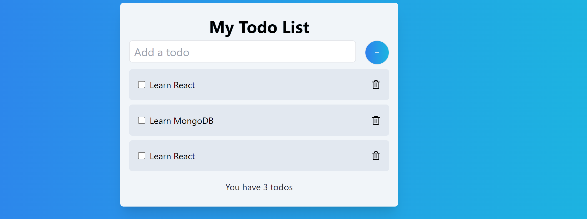

# Todo List App

This is a simple Todo List web application built with React and Firebase. It allows you to add, update, and delete tasks. Each task can be marked as complete or incomplete. The application uses Firebase Firestore to store and sync the tasks in real-time.


## Features

- Add new tasks to your list.
- Mark tasks as complete or incomplete.
- Delete tasks from your list.
- Real-time synchronization of tasks using Firebase Firestore.

## Technologies Used

- React: A JavaScript library for building user interfaces.
- Firebase Firestore: A NoSQL cloud database for real-time data storage and synchronization.
- React Icons: A library for including icons in React applications.
- Vite: A fast and minimalist build tool for JavaScript and React applications.
- Tailwind CSS: A utility-first CSS framework for building modern and responsive web applications.

## Getting Started

To run this application locally, follow these steps:

1. Clone the repository to your local machine:

   ```bash
   git clone <repository-url>
   ```

2. Navigate to the project directory:

   ```bash
   cd todo-list-app
   ```

3. Install the dependencies:

   ```bash
   npm install
   ```

4. Create a Firebase project and set up Firebase Firestore. Replace the Firebase configuration in `firebase.js` with your own configuration.

5. Start the development server:

   ```bash
   npm start
   ```

6. Open your browser and access the application at `http://localhost:3000`.

## Usage

- To add a new task, enter the task description in the input field and click the "Add" button (or press Enter).
- To mark a task as complete or incomplete, click the checkbox next to the task.
- To delete a task, click the trash icon next to the task.

## Firebase Firestore Configuration

To use Firebase Firestore for data storage, you need to set up a Firebase project and configure it in the `firebase.js` file. Replace the following configuration with your Firebase project details:

```javascript
import { initializeApp } from "firebase/app";
import { getFirestore } from "firebase/firestore";

const firebaseConfig = {
  apiKey: "YOUR_API_KEY",
  authDomain: "YOUR_AUTH_DOMAIN",
  projectId: "YOUR_PROJECT_ID",
  storageBucket: "YOUR_STORAGE_BUCKET",
  messagingSenderId: "YOUR_MESSAGING_SENDER_ID",
  appId: "YOUR_APP_ID",
};

const app = initializeApp(firebaseConfig);
const db = getFirestore(app);

export { db };
```

## License

This project is licensed under the MIT License. See the [LICENSE](LICENSE) file for details.

## Acknowledgments

- This project was built as a learning exercise for React and Firebase.
- Special thanks to the developers of Vite, React, and Firebase for creating these amazing tools and technologies


